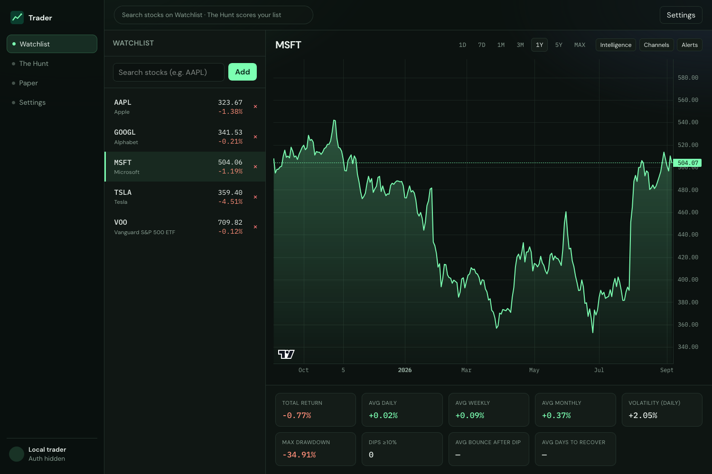
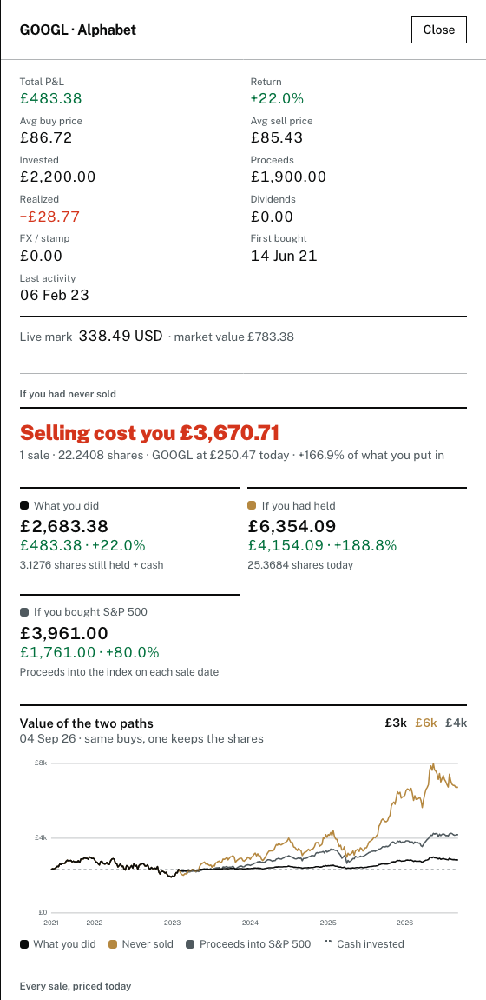
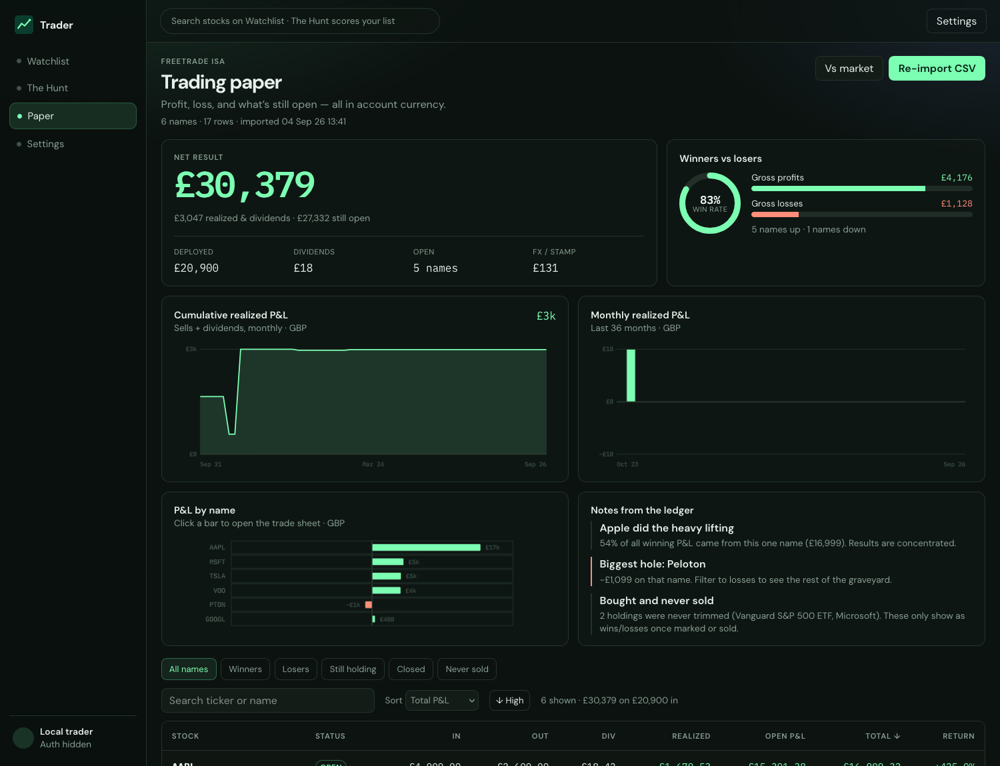

# Trader — Watchlist, Paper P&L, and Price Alerts

Track a watchlist, import your broker history, and find out what your selling actually cost you.

**Live: https://trader-eight-iota.vercel.app**

Guests can browse market data and search; a portfolio needs a sign-in. Auth is Better Auth running inside Convex, using email and password.



## Highlights

- **Watchlist + charts.** Live quotes, historical candles, and non-AI analytics per symbol.
- **Paper.** Import a Freetrade activity CSV to get realized and open P&L, per-position trade sheets, and a comparison against the S&P 500 and FTSE 100.
- **If you had never sold.** Pick any position you sold and replay it against the market.
- **The Hunt.** Opportunity scoring, catalysts, and scenario simulation, with optional AI rationales.
- **Alerts.** Price and percentage-move rules delivered to email, Telegram, or Twist.

## If you had never sold

Open any sold position on the Paper page and the drawer replays it three ways, valued day by day from the same buys:

| Path | What it assumes |
|------|-----------------|
| What you did | Shares still held marked to market, plus the cash each sale raised, plus dividends |
| If you had held | Every share ever bought is still held today, dividends scaled to that larger share count |
| If you bought the index | Each sale's proceeds go into the S&P 500 on the sale date |



Broker exports record shares as traded, while Yahoo closes are split-adjusted, so a pre-split buy would otherwise be counted at a fraction of its real size. Rather than trust split rows that exports often omit, each trade's price is compared against the adjusted close that day. The ratio between them is the split factor, and it is snapped onto a known split ratio only when it lands close to one. Anything ambiguous falls back to the broker's own split records.

The counterfactual deliberately assumes nothing else changed. That flatters holding, since in reality the money went somewhere, which is why the index path sits alongside it.

## Paper P&L



Positions are grouped by ISIN, so a ticker change carries its history across. Realized P&L uses average cost. Open positions are marked with live quotes and converted to account currency at each day's rate.

## Stack

- **Web:** Vite, React, TanStack Query, TanStack Router, Lightweight Charts
- **Backend:** Convex functions — queries and mutations in the V8 runtime, Node actions for anything touching Yahoo Finance
- **Auth:** Better Auth via the Convex component
- **Alerts:** a Convex cron every 5 minutes → Email (Resend), Telegram, Twist

The backend is entirely Convex. Market data, the Freetrade import, the P&L
computations and the never-sold replay all run as Node actions, because
`yahoo-finance2` needs Node builtins that the default runtime does not have.
The pure computation lives in `lib/` outside `convex/`, so it is bundled into
whichever runtime imports it and stays unit-testable.

## Quick start

### 1. Install

```bash
npm install
npm run build -w @trader/shared
```

### 2. Convex

```bash
npx convex dev
```

The first run provisions a dev deployment and writes `CONVEX_DEPLOYMENT`,
`VITE_CONVEX_URL` and `VITE_CONVEX_SITE_URL` into the repo-root `.env.local`.
Vite reads env from the repo root (`envDir` in `apps/web/vite.config.ts`), so
there is one env file, not two.

Set the deployment's own secrets:

```bash
npx convex env set SITE_URL http://localhost:5173
npx convex env set BETTER_AUTH_SECRET "$(openssl rand -hex 32)"
```

| Convex variable | Purpose |
|-----------------|---------|
| `SITE_URL` | Origin the app is served from; Better Auth trusts it |
| `BETTER_AUTH_SECRET` | Session secret |
| `RESEND_API_KEY` / `EMAIL_FROM` | Email alerts (dry-runs if unset) |
| `TELEGRAM_BOT_TOKEN` / `TELEGRAM_BOT_USERNAME` | Telegram bot |
| `TELEGRAM_WEBHOOK_SECRET` | Optional webhook header check |
| `TWIST_ACCESS_TOKEN` | Optional Twist token |
| `DEEPSEEK_API_KEY` | Optional AI rationales on The Hunt |

### 3. Run

```bash
npx convex dev          # one terminal: functions, codegen, live push
npm run dev:web         # another: http://localhost:5173
```

### 4. Tests

```bash
npm test
```

Covers the never-sold replay, the Freetrade parser and opportunity scoring.

## App surfaces

| Route | What it does |
|-------|----------------|
| `/` | Watchlist, historical chart, per-symbol analytics, alerts and channels |
| `/intelligence` | The Hunt: opportunity scores, catalysts, predictions, scenarios |
| `/portfolio` | Paper: imported broker P&L, per-position drawers, vs-market comparison |
| `/settings` | Broker import, channels, Telegram link |

Every call the UI makes goes through `apps/web/src/lib/queries.ts`, which is the
only file that knows about Convex.

## Importing from Freetrade

Freetrade has no public API, so the import takes the activity CSV export. Drop the file on either the Settings page or the Paper page, and transactions, holdings, and optionally your watchlist are populated. Each import replaces the previous one rather than merging into it, so always upload a full export rather than a slice.

## Analytics (non-AI)

For the selected range and customizable inputs:

- Average daily / weekly / monthly returns
- Volatility and max drawdown
- Dip recovery: avg bounce and days to recover after ≥X% dips
- What-if P/L for $1,000 / $10,000 (or any amount)

## Alerts worker

`convex/crons.ts` runs the alert cycle every 5 minutes. It evaluates enabled rules, delivers to the channels each rule names, and writes an `alertEvents` row. Without provider API keys, deliveries are logged as dry-runs.

## Telegram setup

1. Create a bot with BotFather; set `TELEGRAM_BOT_TOKEN` and `TELEGRAM_BOT_USERNAME`
2. Point the webhook at `POST https://<deployment>.convex.site/telegram/webhook` (optional secret header)
3. In the app, open **Channels → Generate Telegram link** and tap Start

## Deploying

Convex hosts the backend; Vercel serves the built SPA. One Vercel build does both:

```
npx convex deploy --cmd 'npm run build' --cmd-url-env-var-name VITE_CONVEX_URL
```

That pushes the functions to the production Convex deployment and then builds
the frontend with that deployment's URL injected. It needs `CONVEX_DEPLOY_KEY`
in the Vercel project, minted with `npx convex deployment token create <name> --prod`.

Vercel also needs `VITE_CONVEX_SITE_URL` (the `.convex.site` origin, where the
auth endpoints live) and `VITE_AUTH_ENABLED=true`. On the production Convex
deployment, set `SITE_URL` to the deployed origin so Better Auth trusts it.

Two things to know. The auth endpoints live on a different origin from the app,
so the client uses Better Auth's cross-domain plugin pair; without it, sign-in
silently fails. And Convex crons have no plan-tier floor, so alerts run every
five minutes rather than the once a day a Vercel Hobby plan allows.

## Project layout

```
convex            Convex functions, schema, auth, crons
lib               Pure computation shared by the functions, plus its tests
apps/web          React SPA
packages/shared   Zod schemas + shared types
docs/screenshots  README images
```

## A note on the numbers

This is a personal tracking tool, not advice. Prices come from Yahoo Finance and can be wrong, delayed, or missing. Realized P&L uses average cost and ignores tax treatment entirely.

Screenshots use a synthetic portfolio, not real holdings.
